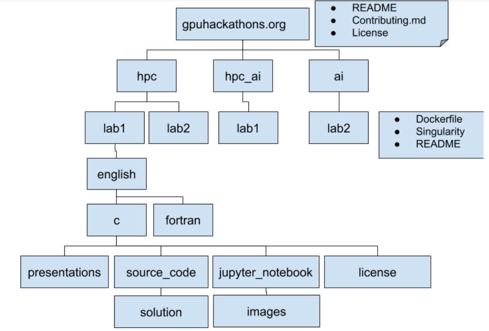
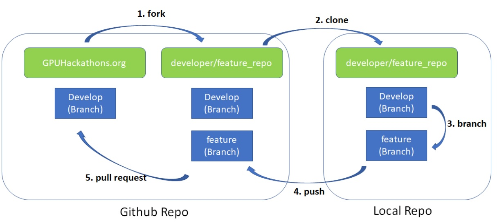

Contributing
------------

Please use the following guidelines when contributing to this project. 

Before contributing significant changes, please begin a discussion of the desired changes via a GitHub Issue to prevent doing unnecessary or overlapping work.

## License

The preferred license for source code contributed to this project is the Apache License 2.0 (https://www.apache.org/licenses/LICENSE-2.0) and for documentation, including Jupyter notebooks and text documentation, is the Creative Commons Attribution 4.0 International (CC BY 4.0) (https://creativecommons.org/licenses/by/4.0/). Contributions under other, compatible licenses will be considered on a case-by-case basis.

## Styling

Please use the following style guidelines when making contributions.

### Source Code
* Two-space indentation, no tabs
* To the extent possible, variable names should be descriptive
* Code should be documentation with detail like what function does and returns making the code readable. The code should also have proper license at the beginning of the file.
* Fortran codes should use free-form source files
* Fortran codes should not use implicit variable names and should use implicit none
* The following file extensions should be used appropriately
	* C - .c
	* C++ - .cpp
	* CUDA C/C++ - .cu
	* CUDA Fortran - .cuf
	* Fortran - .F90
	* Python = .py

### Jupyter Notebooks & Markdown
* When they appear inline with the text; directive names, clauses, function or subroutine names, variable names, file names, commands and command-line arguments should appear between two backticks.
* Code blocks should begin with three backticks and either 'cpp' or 'fortran' to enable appropriate source formatting and end with three backticks.
* Leave an empty line before and after the codeblock.
Emphasis, including quotes made for emphasis and introduction of new terms should be highlighted between a single pair of asterisks
* A level 1 heading should appear at the top of the notebook as the title of the notebook.
* A horizontal rule should appear between sections that begin with a level 2 heading.

Please refer to the following template for jupyter notebook styling in the github repository:misc/jupyter_lab_template 

## Contributing Labs/Modules

### Directory stucture for Github

Before starting to work on new lab it is important to follow the recommended git structure as shown below to avoid and reformatting:

Top level directories consist for 3 folders
* hpc: This directory contains labs related to HPC(Simulation) and parallel computing 
* hpc_ai: This directory contains labs related to usage of AI/ML/DL for Science/HPC Simulations
* ai : This directory consists of labs related to traditional AI/ML/DL techniques and frameworks 

Each lab will have following files/directories consisting of training material for the lab.
* jupyter_notebook folder: Consists of jupyter notebooks and its corresponding images.  
* source_code folder :Source codes are stored in a separate directory because sometime not all clusters may support jupyter notebooks. During such bootcamps, we should be able to use the source codes directly from this directory. Source code folder may optionally contain Makefile especially for HPC labs. 
* presentations: Consists of presentations for the labs ( pdf format is preferred )
* Dockerfile and Singularity  : Each lab should have both Docker and Singularity recipes.
 
The lab optionally may also add custom license in case of any deviation from the top level directory license ( Apache 2.0 ). The base of the module contains individual subdirectory containing versions of the module for languages respectively(C/C++/Fortran…). Each of these directories should contain a directory for individual language translation provided (English, for instance). Each lab translation and programming language combination should have a solutions directory containing correct solutions

Additionally there are two folders "experimental" and  "archived" for labs covering features which are in early access phase ( not stable ) or deprecated features repectively.

### Git Branching

Adding a new feature/lab will follow a forking workflow. Which means a feature branch development will happen on a forked repo which later gets merged into our original project (GPUHackathons.org) repository.

The 5 main steps depicted in image above are as follows:
1. Fork: To create a new lab/feature the GPUHackathons.org repository must be forked. Fork will create a snapshot of GPUHackathons.org repository at the time it was forked. Any new feature/lab that will be developed should be based on the develop branch of the repository.
2.  Clone: Developer can than clone this new repository to local machine
Create Feature Branch: Create a new branch with a feature name in which your changes will be done. Recommend naming convention of feature branch is naming convention for branch: hpc-<feature_name>,hpc-ai-<feature_name>, ai-<feature_name>. The new changes that developer makes can be added, committed and pushed
3. Push: After the changes are committed, the developer pushes the changes to the remote branch. Push command helps the local changes to github repository
4. Pull: Submit a pull request. Upon receiving pull request a Hackathon team reviewer/owner will review the changes and upon accepting it can be merged into the develop branch of GpuHacakthons.org

Git Branch details are as follows:

* master branch: Consists of the stable branch. 
	* origin/master to be the main branch where the source code of HEAD always reflects a production-ready state
	* Merge request is possible through:  develop branch
* develop branch: branched from master branch
	* Must branch from: master branch
	* Must merge back into: master branch
	* It is the main development branch where the source code of HEAD always reflects a state with the latest delivered development changes for the next release.
	* When the source code in the develop branch reaches a stable point and is ready to be released, all of the changes should be merged back into master somehow and then tagged with a release number
	* All feature development should happen by forking GPUHackathons.org and branching from develop branch only.
